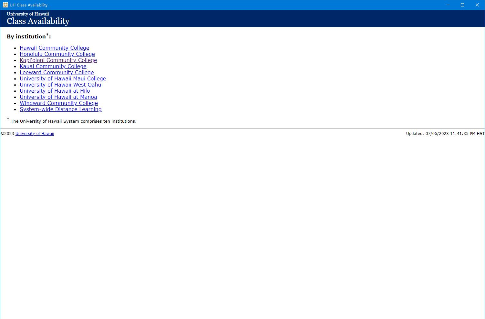
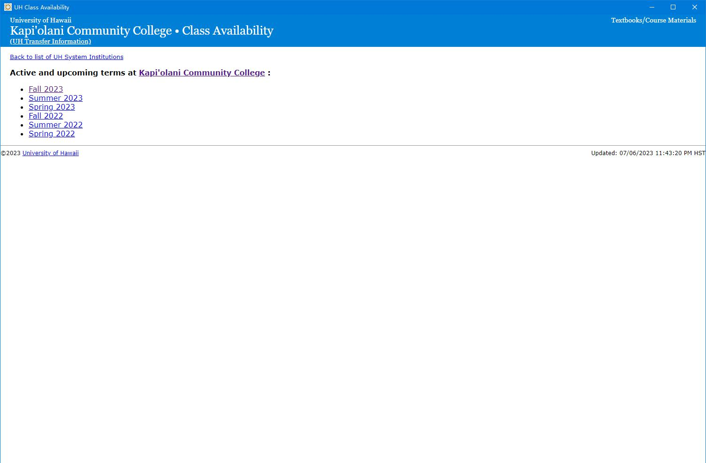
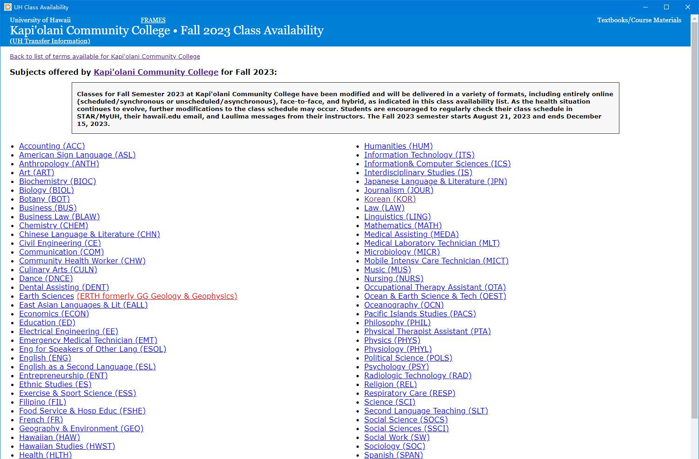
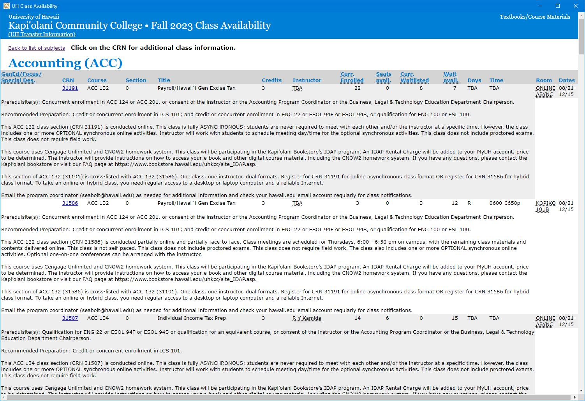

# uh-class-availability
使用rust语言的tarui框架将university of Hawaii class availability 网页版 封装为的university of Hawaii class availability 客户端GUI  
The tarui framework of rust language is used to encapsulate the university of Hawaii class availability web version as the university of Hawaii class availability client desktop

